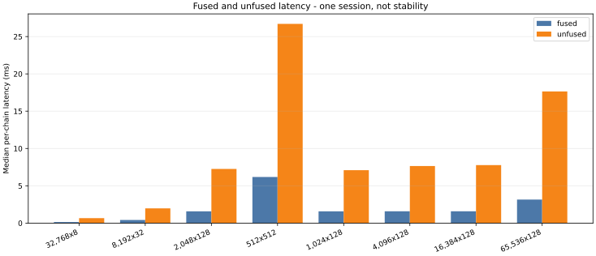
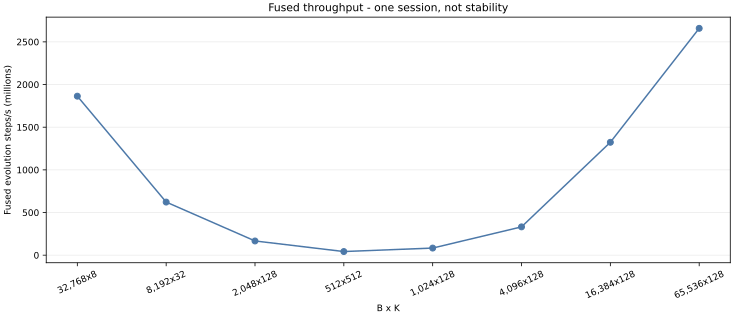
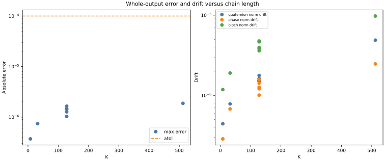
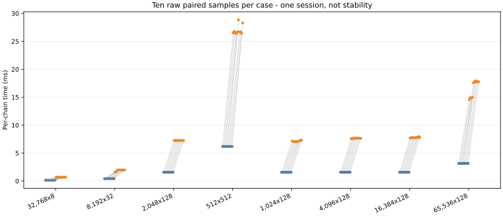
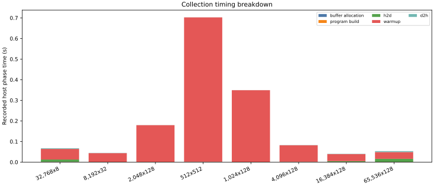

# Fused Time-Ordered SU(2) Composition on Tenstorrent Wormhole

> **RQM runs fused time-ordered SU(2) evolution for two-level Hamiltonian simulation on Tenstorrent Wormhole.**

H1 lowers piecewise-constant two-level Hamiltonian coefficients into FP32
rotors and phase pairs on the CPU. Wormhole performs their ordered composition.
H2 will address device-side Hamiltonian coefficient lowering. H1 is a real
stage of a Hamiltonian-simulation pipeline, not the complete device-side
pipeline.

The fused and unfused paths passed N300 device-0 conformance before and after
the audited eligibility promotion. The first comparison is **Claim Level 1: a
qualified first comparison sample**. It remains `stable_benchmark=false` and
does not establish an acceleration or stability claim.

The historical report Markdown is hash-bound release evidence and remains
byte-for-byte unchanged. This page and the claim policy provide the current,
more precise public framing; future generated reports use the same wording.

## Kernel Architecture

H1 lowers time-dependent two-level Hamiltonians into FP32 rotors and phase
pairs on the CPU. One binary then runs two matched paths on Wormhole device 0:

- **Unfused:** K-1 persistent qmul-plus-phase dispatches with DRAM ping-pong
  accumulators and runtime-argument updates.
- **Fused:** one reader-compute-writer workload that retains four rotor and two
  phase accumulator tiles in Tensix L1 across the complete chain.

Both paths use the same step-major, component-planar 32x32-tile input. All
Hamilton-product and phase arithmetic is in the compute/SFPU kernels; the
reader and writer perform only DMA and synchronization. Trajectory tiles are
split row-major across up to 56 Tensix cores.

## Problem Definition

For `B` independent trajectories and `K` piecewise-constant steps, H1 consumes
rotors `[B,K,4]` and complex phase pairs `[B,K,2]`. It returns one rotor and
phase per trajectory in exact `K-1 ... 0` multiplication order.

The inputs include varying, noncommuting Hamiltonians. Alternating x- and
y-axis rotations make an accidental order reversal fail visibly.

## First Hardware Comparison

The balanced-work cases below are exact medians from one public session. Each
case has two warmup pairs and ten measured pairs with alternating path order.
They are supporting evidence, not the headline claim.

| B | K | Tensix cores | fused median | unfused median | fused/unfused |
|---:|---:|---:|---:|---:|---:|
| 32,768 | 8 | 32 | 0.141 ms | 0.667 ms | 0.211 |
| 8,192 | 32 | 8 | 0.421 ms | 1.977 ms | 0.213 |
| 2,048 | 128 | 2 | 1.575 ms | 7.256 ms | 0.217 |
| 512 | 512 | 1 | 6.180 ms | 26.700 ms | 0.231 |

The same session also covers B=1,024/4,096/16,384/65,536 at K=128. See the
[canonical report](../../reports/tt_hardware_su2_compose_first_comparison.md),
[release manifest](../../benchmarks/manifests/wormhole-su2-compose.json), and
[processed evidence](../../benchmarks/processed/wormhole-su2-compose-summary.json).





## Correctness

Two independent CPU oracles are used: complex128 matrix exponentiation and
Float64 quaternion-plus-phase composition. Every hardware output was checked
against the exact serialized FP32 inputs; no primary output was renormalized.

All eight cases recorded zero failing and zero nonfinite values. The largest
fused max absolute error was `1.868e-6`, below the preregistered `1e-4`
tolerance. The report also records matrix and state-vector error, rotor and
phase norm drift, unitarity, determinant and global-phase consistency, Bloch
norm drift, and error versus chain length.



## Performance Methodology

The exact cases, repeat counts, timing boundaries, logical-traffic formulas,
claim gates, and nonclaims were fixed before collection in the
[machine-readable preregistration](../../benchmarks/manifests/su2-compose-preregistration.json).
The [raw paired samples](../../benchmarks/raw/su2-compose/2026-07-14-n300-device0-session-1/raw-samples.json)
and generated SVGs are deterministic products of the committed hardware
report. Validate everything without hardware using:

```bash
python scripts/reproduce_wormhole_su2_compose.py --check
```





## Limitations And Nonclaims

H1 composes pre-lowered evolution operators. It is a real stage of a quantum
Hamiltonian simulation pipeline, but it is not yet device-side coefficient
lowering. This one session remains `stable_benchmark=false` and does not
support an acceleration, CPU-comparison, measured-bandwidth, energy,
dual-device, or Tenstorrent-endorsement claim. Level 2 requires three
independent cold-start sessions with complete correctness and the
[preregistered p95-relative dispersion and cross-session median-deviation
limits](../su2-stability-methodology.md). This is not a
coefficient-of-variation test.
