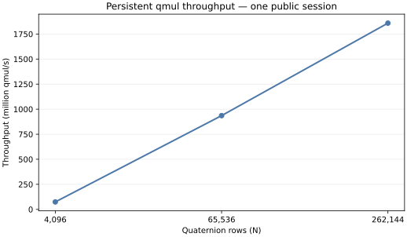
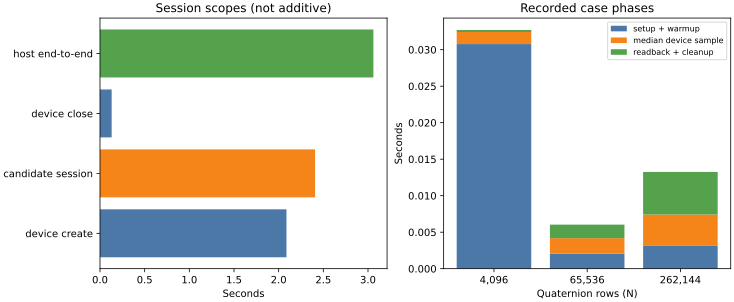
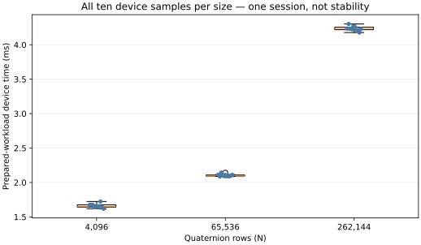
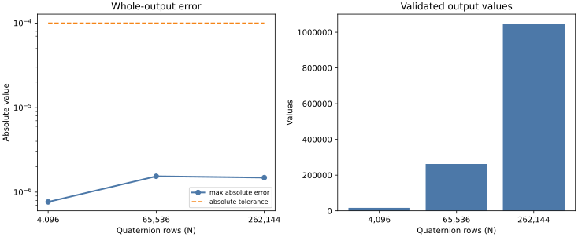

# Structured FP32 Quaternion Kernels on Tenstorrent Wormhole

This report covers real-device correctness, the multicore compute architecture,
and three independent persistent timing sessions.

> **Qualification: Claim Level 2 — stable one-device performance.**
>
> Three device-0 cold starts passed the preregistered stability gates.

## Kernel contract

```text
qmul: Float32 [N, 4] x [N, 4] -> [N, 4]
lanes: [real, i, j, k]
operation: Hamilton product
model: 28 floating-point operations and 48 logical bytes per qmul
```

Host AoS values are converted into planar 32x32 Float32 tiles. A reader
data-movement kernel transfers eight component planes into circular buffers; a
Tensix compute kernel performs the Hamilton-product multiply/add/subtract
arithmetic; and a writer data-movement kernel transfers four output planes to
DRAM. Tiles are split row-major over `min(component_tiles, 56)` Tensix cores on
Wormhole device 0. The persistent candidate creates that device once for the
three-size session and closes it once.

The [architecture audit](../../reports/tt_hardware_qmul_stage_b_architecture_audit.md)
checks that arithmetic is in the compute path rather than the data-movement
kernels. The [timing audit](../../reports/tt_hardware_qmul_stage_b_persistent_timing_audit.md)
defines the synchronization and timer boundaries.

## Representative session

The table shows the first qualified session. Throughput uses median
prepared-workload device time. “Logical GB/s” is a fixed traffic model, not
measured DRAM, NoC, or PCIe bandwidth.

| N | cores | median device ms | p95 device ms | qmul/s | logical GB/s | validated values | max abs error |
|---:|---:|---:|---:|---:|---:|---:|---:|
| 4,096 | 4 | 1.651627 | 1.724061 | 74,399,342 | 3.571 | 16,384 | 7.663e-07 |
| 65,536 | 56 | 2.101087 | 2.143976 | 935,744,212 | 44.916 | 262,144 | 1.542e-06 |
| 262,144 | 56 | 4.231194 | 4.303374 | 1,858,652,664 | 89.215 | 1,048,576 | 1.487e-06 |

Every result passed the independent Float64 Hamilton-product golden across the
whole output with `atol=1e-4`, `rtol=1e-4`, zero failing values, and zero
non-finite values.

Across the three sessions, maximum within-session dispersion / maximum
cross-session median deviation was 6.2083% / 3.2133% at N=4,096,
2.0413% / 2.4194% at N=65,536, and 1.7059% / 0.9190% at N=262,144. All are
within the preregistered limits. See the
[qualification artifact](../../benchmarks/processed/wormhole-qmul-stability-qualification.json).









## Timing and provenance

The primary time is the median of ten prepared-workload device samples. Separate
fields preserve device creation, buffer allocation, program build, H2D,
prewarm synchronization, warmup, every measured sample, D2H, cleanup, device
close, candidate-session time, and host-process end-to-end time.

| Evidence field | Value |
|---|---|
| Hardware scope | one Wormhole device, logical device 0 |
| Candidate SHA-256 | `179a5cc3e6b146a1e8c61e61ab9ab173bbc543f88181b91c8621a7e959c98ce5` |
| Execution-source commit | `3ae68815e8ac025e49f09d3797dbbac2f77245b3` |
| TT-Metalium commit | `dd2849b5bc6b7a5d38a9eafbeba31ef8d530f8d4` |
| Candidate session | 2.407865554 s |
| Device creation / close | 2.087592366 s / 0.130627294 s |
| Host process end-to-end | 3.060525127 s |

The canonical [JSON report](../../reports/tt_hardware_qmul_stage_b_persistent_performance.json),
[environment record](../../reports/tt_hardware_qmul_stage_b_persistent_environment.txt),
and [Level 2 release manifest](../../benchmarks/manifests/wormhole-qmul-level2.json)
are the sources of truth. The original
[Level 1 manifest](../../benchmarks/manifests/wormhole-qmul.json) remains
unchanged.

## Reproduce and validate

Install the development dependencies and validate hashes, provenance, claim
gates, normalized data, and byte-for-byte plot regeneration:

```bash
python -m pip install -e ".[dev]"
python scripts/reproduce_wormhole_qmul.py --check
```

Regenerate the committed outputs explicitly:

```bash
python scripts/generate_benchmark_plots.py
python scripts/validate_benchmark_release.py
```

New hardware evidence is opt-in. It must name a real persistent candidate and
writes to a new timestamped directory under `benchmarks/raw`:

```bash
python scripts/reproduce_wormhole_qmul.py \
  --collect-stage performance \
  --command /absolute/path/to/tt_rqm_metalium_qmul_multicore_persistent_candidate
```

## Limits and next measurements

This release does not make a hardware-bandwidth, CPU, energy, application,
dual-device, acceleration, or Tenstorrent-endorsement claim. Controlled scaling,
device parity, profiling, ceilings, and saturation measurements are reported
separately as [diagnostic evidence](wormhole-qmul-hardware-evidence.md).
